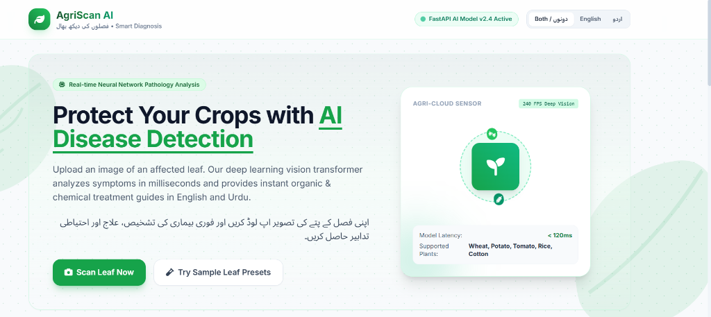
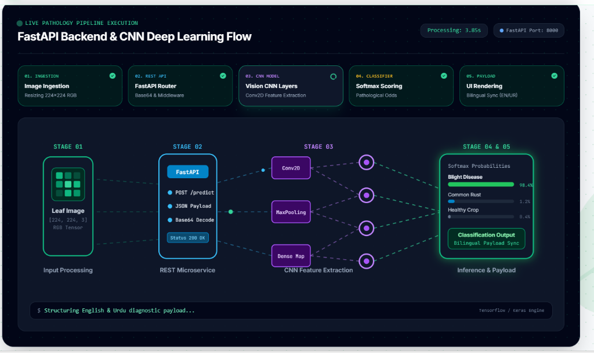

# 🌱 AgriScan AI - Crop Disease Detection

> **An advanced, full-stack AI application that detects crop diseases using a custom PyTorch Convolutional Neural Network (CNN) and provides instant bilingual (English & Urdu) organic and chemical treatment recommendations.**



## 🚀 Features
* **Real-time Inference:** Lightning-fast disease classification using a custom-trained CNN on the PlantVillage dataset (39 classes).
* **Bilingual Support:** Instantly translates pathological data, symptoms, and treatments into Urdu for local farmers.
* **Fully Containerized:** Includes a `Dockerfile` for easy, one-click serverless deployment on platforms like Render or Google Cloud Run.
* **Local History:** Saves recent scans directly in your browser using `localStorage`.
* **Glassmorphic UI:** A premium, fully responsive TailwindCSS frontend with beautiful micro-animations and data-flow visualizations.



## 🛠️ Tech Stack
* **Frontend:** HTML5, Tailwind CSS, Vanilla JavaScript
* **Backend:** FastAPI, Python 3.10
* **Machine Learning:** PyTorch, Torchvision (Custom CNN Architecture)
* **Deployment:** Docker

## ⚙️ Quick Start (Local Development)

### 1. Install Dependencies
Make sure you have Python installed. Then run:
```bash
pip install -r backend/requirements.txt --no-cache-dir
```

### 2. Run the Application
You can easily start the application by running the provided batch script:
```cmd
.\start.bat
```
*(This will automatically start the FastAPI backend on port 8000 and open the frontend UI in your default browser).*

## 🐳 Docker Deployment (Cloud)
This project is ready to be deployed to free cloud platforms like Render.com!

```bash
docker build -t agriscan-ai .
docker run -p 7860:7860 agriscan-ai
```

---
*Developed for intelligent, accessible, and fast agricultural diagnostics.*
